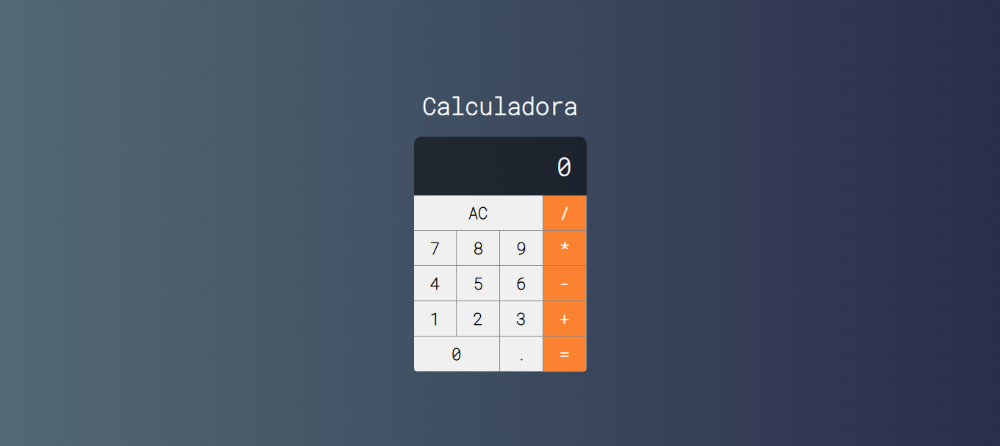

<h2 id="sobre-o-projeto">1. Calculadora Vue: Engenharia de Estados 🧮</h2>


[](https://github.com/Domisnnet/Calculator-Vue.Js/blob/main/LICENSE)



Bem-vindo à **Calculadora Vue**! Diferente de uma calculadora simples em JS, este projeto utiliza o ecossistema **Vue.js** para gerenciar uma interface reativa e modular. O foco aqui foi a criação de um componente principal (`MainCalculator`) que orquestra a lógica aritmética enquanto mantém uma interface elegante e minimalista, utilizando tipografia customizada para uma experiência de usuário superior.

---

## 📚 Tabela de Conteúdo

| 🧮 O Projeto | 🛠️ Técnico | 🤝 Comunidade |
| :---: | :---: | :---: |
| [](#sobre-o-projeto) | [](#destaques-tecnicos) | [](#codigo-fonte) |
| [](#tecnologias-utilizadas) | [](#instalacao) | [](#créditos) |
| [](#como-acessar) | [](#como-contribuir) | [](#licenca) |
| [](#funcionalidades) | [](#faq) | [](#perfil-do-github) |

---

<h2 id="tecnologias-utilizadas">2. ⚙️ Tecnologias Utilizadas</h2>

| Camada | Tecnologias | Descrição |
| :--- | :--- | :--- |
| **Framework** |  | Reatividade para atualização instantânea do visor e lógica de cálculo. |
| **Estilo** |  | Layout Flexbox centralizado com gradientes lineares sofisticados. |
| **Tipografia** |  | Uso de `@font-face` para garantir uma identidade visual técnica e moderna. |

---

<h2 id="como-acessar">3. 🚀 Como Acessar</h2>

Faça seus cálculos com precisão reativa agora mesmo:

<div align="left">
  <a href="https://github.com/Domisnnet/Calculator-Vue.Js" target="_blank">
    
  </a>
</div>

---

<h2 id="funcionalidades">4. 🧩 Funcionalidades Principais</h2>

Esta calculadora foi projetada para ser rápida e funcional:

| Funcionalidade | Descrição |
| :--- | :--- |
| 🔢 **Operações Básicas** | Soma, subtração, multiplicação e divisão com alta precisão. |
| 🧹 **Limpeza (AC)** | Reset instantâneo de todos os valores e memórias de cálculo. |
| 📱 **Display Dinâmico** | Visor que se adapta ao tamanho dos números inseridos. |
| 🎨 **Design Imersivo** | Interface em modo escuro com gradientes suaves para conforto visual. |
| 🛠️ **Arquitetura Modular** | Componentes separados para botões e visor, facilitando a manutenção. |

---

<h2 id="destaques-tecnicos">5. 💻 Destaques Técnicos</h2>

O projeto explora as melhores práticas de componentes no Vue:

### 📐 Organização de Componentes
A separação da lógica no `MainCalculator.vue` permite que o arquivo principal `App.vue` cuide apenas do layout global e do posicionamento, seguindo o princípio da responsabilidade única.

### 🔄 Tipografia Customizada
A implementação de fontes locais via `@font-face` assegura que o design "RobotoMono" seja carregado de forma consistente, independente de conexões externas com servidores de fontes, melhorando o desempenho.

---

<h2 id="instalacao">6. 🚀 Instalação e Configuração Local</h2>

Explore a lógica de componentes desta Calculadora:

```bash
# Clonar o repositório
git clone https://github.com/Domisnnet/Calculator-Vue.Js.git(https://github.com/Domisnnet/Calculator-Vue.Js.git)

# Acessar a pasta
cd Calculator-Vue.Js
```

---

<h2 id="como-contribuir">7. 🤝 Como Contribuir</h2>

Siga os passos abaixo para adicionar novas funções matemáticas:

| Fase | Ação | Link / Comando |
| :---: | :--- | :--- |
| **01** | **Fork** | [](https://github.com/Domisnnet/Calculator-Vue.Js/fork) |
| **02** | **Branch** | `git checkout -b feature/FuncaoPorcentagem` |
| **03** | **Commit** | `git commit -m 'feat: adição da lógica de porcentagem'` |
| **04** | **Push** | `git push origin feature/FuncaoPorcentagem` |
| **05** | **PR** | [](https://github.com/Domisnnet/Calculator-Vue.Js/compare)

### 🐛 Encontrou um problema?
Se algo não estiver funcionando como esperado, não hesite em abrir um chamado:

[](https://github.com/Domisnnet/Calculator-Vue.Js/issues)
[](https://github.com/Domisnnet/Calculator-Vue.Js/issues/new)

---

<h2 id="faq">8. 🧠 Perguntas Frequentes</h2>

<details>
<summary><strong>Como a calculadora lida com decimais ❓</strong></summary>
<p>🔢 <strong>Resposta:</strong> A lógica foi preparada para aceitar pontos decimais e realizar conversões de string para float de forma transparente para o usuário.</p>
</details>

<details>
<summary><strong>Posso mudar as cores do fundo ❓</strong></summary>
<p>🎨 <strong>Resposta:</strong> Sim! No arquivo <code>App.vue</code>, basta alterar os valores de <code>rgb</code> dentro da propriedade <code>background: linear-gradient</code>.</p>
</details>

---

<h2 id="codigo-fonte">9. 💻 Código Fonte</h2>

Analise os componentes e a tipografia do projeto:

[](https://domisnnet.github.io/Calculator-Vue.Js/)

---

<h2 id="créditos">10. 📝 Créditos & Reconhecimentos</h2>

A Calculadora Vue representa um marco na organização de interfaces reativas:

| Atribuição | Responsável / Recurso | Descrição |
| :--- | :--- | :--- |
| **Dev Front-end** | **DomisDev** | Desenvolvimento da arquitetura de componentes e UI. |
| **Framework** | **Vue Team** | Tecnologia base para a reatividade da aplicação. |
| **Fontes** | **Google Fonts** | Fornecimento da tipografia Roboto Mono. |
| **Apoio Técnico** | **Google Gemini** | Padronização King-Domfy e refinamento documental. |

---

<h2 id="licenca">11. 📄 Licença</h2>

Este projeto está licenciado sob a [](https://github.com/Domisnnet/Calculator-Vue.Js/blob/main/LICENSE)

---

<h2 id="perfil-do-github">12. 👨‍💻 Perfil do GitHub</h2>

<a href="https://github.com/Domisnnet"> 
   
</a>